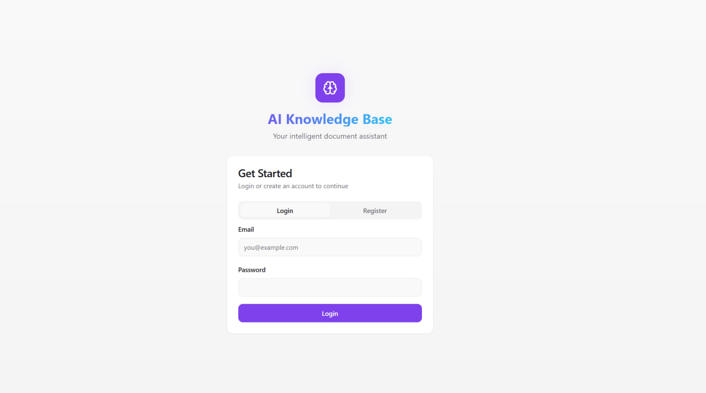
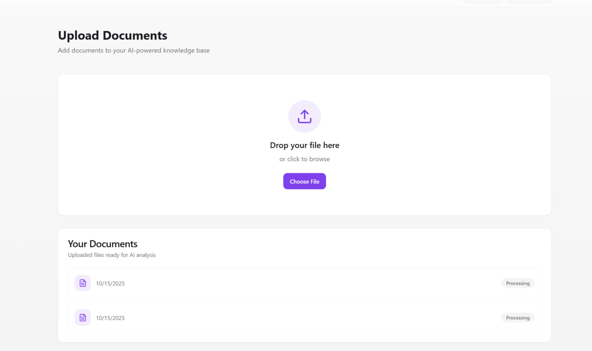
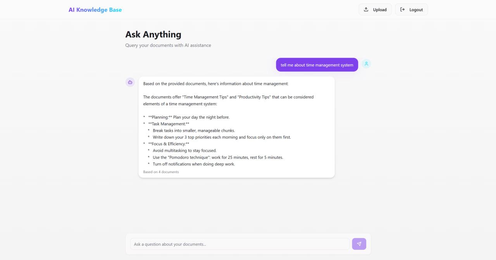

# AI Knowledge Base

This project is a full-stack application that allows users to upload documents and ask questions about them. The backend is a Go API that uses AI to process and query the documents, and the frontend is a React application that provides a user interface for interacting with the API.

## Screenshots

### Login Page


### Upload Page


### Chat Page


## Technologies

### Backend (ai-knowledge-base)

- Go
- Docker
- PostgreSQL
- Redis
- AWS S3
- Gemini API

### Frontend (kb-frontend)

- React
- Vite
- TypeScript
- shadcn-ui
- Tailwind CSS

## Getting Started

### Prerequisites

- Go 1.18 or higher
- Docker and Docker Compose
- AWS CLI
- Node.js and npm

### Backend Setup (ai-knowledge-base)

1. **Navigate to the backend directory:**

   ```bash
   cd ai-knowledge-base
   ```

2. **Install Go dependencies:**

   ```bash
   go mod tidy
   ```

3. **Set up environment variables:**

   Create a `.env` file in the `ai-knowledge-base` directory and add the following environment variables:

   ```
   GEMINI_API_KEY=your-gemini-api-key
   JWT_SECRET=your-jwt-secret
   DB_USER=your-db-user
   DB_PASSWORD=your-db-password
   DB_NAME=your-db-name
   DB_HOST=localhost
   DB_PORT=5432
   REDIS_ADDR=localhost:6379
   AWS_ACCESS_KEY_ID=your-aws-access-key-id
   AWS_SECRET_ACCESS_KEY=your-aws-secret-access-key
   AWS_REGION=your-aws-region
   S3_BUCKET=your-s3-bucket
   ```

4. **Run the database and Redis using Docker Compose:**

   ```bash
   docker-compose up -d
   ```

5. **Run the database migrations:**

   ```bash
   go run ./migrations
   ```

6. **Run the server:**

   ```bash
   go run ./cmd/server/main.go
   ```

   The server will be running at `http://localhost:8080`.

### Frontend Setup (kb-frontend)

1. **Navigate to the frontend directory:**

   ```bash
   cd kb-frontend/lumen-insight-api
   ```

2. **Install the necessary dependencies:**

   ```bash
   npm i
   ```

3. **Start the development server:**

   ```bash
   npm run dev
   ```

   The frontend will be running at `http://localhost:5173`.

## API Documentation

Below is the OpenAPI 3.0 specification for the API. You can also find the specification in the `ai-knowledge-base/docs/openapi.yaml` file.

```yaml
openapi: 3.0.0
info:
  title: AI Knowledge Base API
  description: API for a knowledge base powered by AI.
  version: 1.0.0
servers:
  - url: http://localhost:8080
    description: Local server
paths:
  /auth/register:
    post:
      summary: Register a new user
      requestBody:
        required: true
        content:
          application/json:
            schema:
              type: object
              properties:
                email:
                  type: string
                  format: email
                password:
                  type: string
              required:
                - email
                - password
      responses:
        '200':
          description: User registered successfully
          content:
            application/json:
              schema:
                type: object
                properties:
                  token:
                    type: string
        '400':
          description: Invalid request or user already exists
  /auth/login:
    post:
      summary: Login a user
      requestBody:
        required: true
        content:
          application/json:
            schema:
              type: object
              properties:
                email:
                  type: string
                  format: email
                password:
                  type: string
              required:
                - email
                - password
      responses:
        '200':
          description: User logged in successfully
          content:
            application/json:
              schema:
                type: object
                properties:
                  token:
                    type: string
        '401':
          description: Invalid credentials
  /api/upload:
    post:
      summary: Upload a document
      security:
        - bearerAuth: []
      requestBody:
        required: true
        content:
          multipart/form-data:
            schema:
              type: object
              properties:
                file:
                  type: string
                  format: binary
      responses:
        '202':
          description: File uploaded successfully, processing started
        '400':
          description: Bad request
        '500':
          description: Internal server error
  /api/query:
    post:
      summary: Query the knowledge base
      security:
        - bearerAuth: []
      requestBody:
        required: true
        content:
          application/json:
            schema:
              type: object
              properties:
                question:
                  type: string
              required:
                - question
      responses:
        '200':
          description: Query successful
          content:
            application/json:
              schema:
                type: object
                properties:
                  answer:
                    type: string
                  context_sources:
                    type: integer
        '400':
          description: Bad request
        '500':
          description: Internal server error
  /api/docs:
    get:
      summary: List uploaded documents
      security:
        - bearerAuth: []
      responses:
        '200':
          description: A list of documents
          content:
            application/json:
              schema:
                type: array
                items:
                  $ref: '#/components/schemas/Document'
        '500':
          description: Internal server error
  /api/gemini:
    post:
      summary: Interact with Gemini AI
      security:
        - bearerAuth: []
      requestBody:
        required: true
        content:
          application/json:
            schema:
              type: object
              properties:
                prompt:
                  type: string
              required:
                - prompt
      responses:
        '200':
          description: Successful response from Gemini
          content:
            application/json:
              schema:
                type: object
                properties:
                  answer:
                    type: string
        '400':
          description: Invalid request
        '500':
          description: Internal server error
components:
  securitySchemes:
    bearerAuth:
      type: http
      scheme: bearer
      bearerFormat: JWT
  schemas:
    Document:
      type: object
      properties:
        ID:
          type: integer
        CreatedAt:
          type: string
          format: date-time
        UpdatedAt:
          type: string
          format: date-time
        DeletedAt:
          type: string
          format: date-time
          nullable: true
        user_id:
          type: integer
        filename:
          type: string
        s3_key:
          type: string
        processed:
          type: boolean
    User:
      type: object
      properties:
        ID:
          type: integer
        CreatedAt:
          type: string
          format: date-time
        UpdatedAt:
          type: string
          format: date-time
        DeletedAt:
          type: string
          format: date-time
          nullable: true
        email:
          type: string
          format: email
    Chunk:
      type: object
      properties:
        ID:
          type: integer
        CreatedAt:
          type: string
          format: date-time
        UpdatedAt:
          type: string
          format: date-time
        DeletedAt:
          type: string
          format: date-time
          nullable: true
        document_id:
          type: integer
        text:
          type: string
    Embedding:
      type: object
      properties:
        ID:
          type: integer
        CreatedAt:
          type: string
          format: date-time
        UpdatedAt:
          type: string
          format: date-time
        DeletedAt:
          type: string
          format: date-time
          nullable: true
        chunk_id:
          type: integer
        vector:
          type: array
          items:
            type: number
            format: float
```